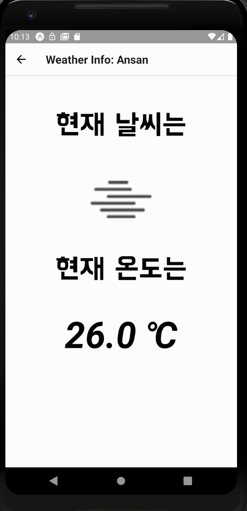

# ajou assignment : ReactNative Android App   
Weather-crawler-app by team 4 in Practical Coding lecture at Ajou Univ.  

## 추가기능  
#### 1. api 아이콘 추가  
###### img(screenshots)  

  

###### commit  
[Fetch weather icon from API](https://github.com/practical-coding-team-4/weather-crawler-app/commit/989f91961f0b895c12977c9c5eae486c7c6877ce)  

###### feature  
이미지가 없는 화면에서 api를 통해 해당 날씨에 관한 아이콘 이미지를 추가하였습니다.  
  
* * *  
  
#### 2. 검색바 추가  
###### img(screenshots)  

  

###### commit  
[Add searchbar for city list](https://github.com/practical-coding-team-4/weather-crawler-app/commit/2a4d738216b222dffe345cf86ebba00cded1359e)  

###### feature  
많은 도시 중 원하는 도시를 스크롤 하면서 찾는 것 보다 검색으로 원하는 도시를 쉽게 접근하도록 검색바를 추가하였습니다.  
  
* * *  
  
#### 3. 임시 폰트 수정(feat.배달의 민족)  
###### img(screenshots)  
  

###### commit  
[Add 'BMHANNA_11yrs' font to WeatherDetailScreen](https://github.com/practical-coding-team-4/weather-crawler-app/commit/444973a75059feb2d5a6b59b53af65c89d9d0db3)  

###### feature  
도시에 대한 글씨의 밋밋함을 글자 크기와 폰트변경으로 편하게 보기 좋게 수정하였습니다.  
  
* * *  
  
#### 4. 자세히 보기 버튼 추가  
###### img(screenshots)  

  

###### commit  
[Add detail weather-info Button(Link)](https://github.com/practical-coding-team-4/weather-crawler-app/commit/eacd8b930cc044e84e36585b92fa8b361ceeda59)  

###### feature  
해당 도시에 대한 weather map사이트 링크를 버튼을 통해 구현하였습니다.  
  
* * *  
  
#### 5. 최종 디자인 수정  
###### img(screenshots)  
  

###### commit  
[Use Minimalist Weather App Template on WeatherDetailScreen](https://github.com/practical-coding-team-4/weather-crawler-app/commit/ae6a8fbc4049eb052881f2fd5f507f1ebd093362)  

###### feature  
밋밋한 디자인을 템플릿을 이용하여 최종적으로 수정하였습니다. 또한 하이퍼링크 버튼(자세한 정보)의 이름과 디자인을 변경하였습니다.  
[최종 디자인 참고 링크](https://blog.expo.io/building-a-minimalist-weather-app-with-react-native-and-expo-fe7066e02c09)  
